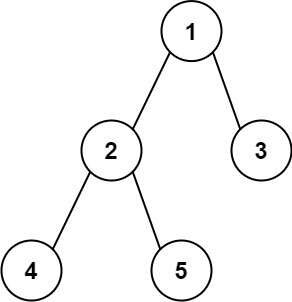

## Задача 7. Бинарное дерево логов
### Что нужно сделать
В программе реализована структура `BinaryTreeNode`, а также функция `walk_tree`, которая обходит бинарное дерево по уровням, при этом записывая в логи номер посещаемого узла и номера его потомков.

Напишите функцию `restore_tree`, которая принимает на вход путь до файла с логами в виде строки, а возвращает корень восстановленного бинарного дерева.

Гарантируется, что все значения, хранящиеся в бинарном дереве, уникальны.

#### Пример построения бинарного дерева


```python
root = BinaryTreeNode(1)
root.left = node2 = BinaryTreeNode(2)
root.right = BinaryTreeNode(3)
node2.left = BinaryTreeNode(4)
node2.right = BinaryTreeNode(5)
```
### Советы и рекомендации
* Создайте словарь `{node_value: node_object}`. Это позволит быстро получить нужный узел по его значению.
* Существует [два основных алгоритма обхода графа](https://habr.com/ru/post/504374/): поиск в глубину (Depth-First Search, DFS) и поиск в ширину (Breadth-First Search, BFS).
### Что оценивается
* Функция `restore_tree` возвращает корень бинарного дерева в виде объекта `BinaryTreeNode`.
* Все узлы дерева из логов обходятся только один раз.
