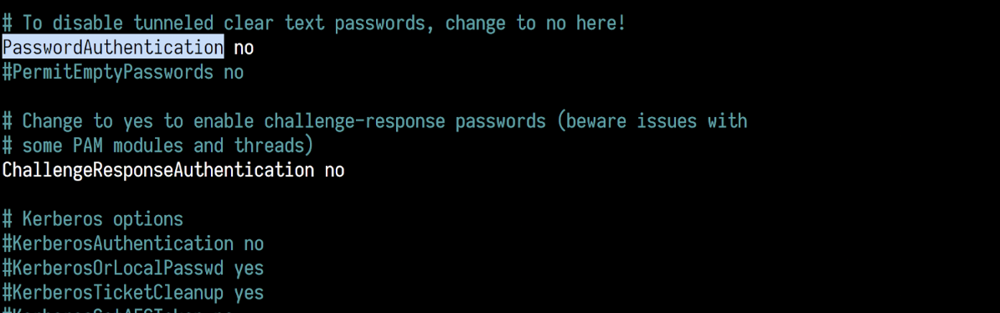
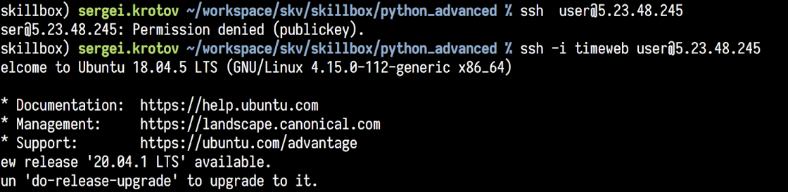

#### Урок 3, задание 2

_Опционально_. Если вы чувствуете себя уверенным в себе пользователем Linux, то обращаем ваше внимание на такой факт. Вы до сих пор можете зайти на машину под пользователем user по логину и паролю. Достаточно просто забыть указать файл с закрытым ключом в качестве аргумента.
Это можно исправить. 

Зайдём на сервер и отредактируем файл конфигурации SSH. Учтите, что это действие может быть опасным. Если ошибиться, то можно уже не зайти на сервер.

```shell
$ sudo nano /etc/ssh/sshd_config
```

Стрелкой вниз домотайте до строки с PasswordAuthentication и вместо _yes_ напишите _no_:



нажмите `Ctrl+O` для сохранения, `Ctrl+X` для выхода.

После этого перечитайте конфигурацию сервера `sshd` (сервер ssh daemon)

```shell
$ sudo systemctl reload sshd.service
```

Теперь всё работает как надо!




