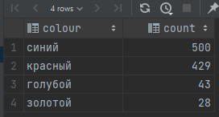

### Сколько телефонов каждого цвета было продано:

* код
  ```sql
  SELECT tp.colour, count(tc.phone_id) count
  FROM table_phones tp 
  JOIN table_checkout tc ON tc.phone_id = tp.id 
  GROUP BY tp.colour ORDER BY count(tc.phone_id) DESC;
  ```
* Ответ: 
  > 
    
### Телефоны какого цвета чаще всего покупают?

* код
  ```sql
  SELECT tp.colour
  FROM table_phones tp 
  JOIN table_checkout tc ON tc.phone_id = tp.id 
  GROUP BY tp.colour 
  ORDER BY count(tc.phone_id) DESC LIMIT 1;
  ```
* Ответ: 
  > синий

### Какие телефоны чаще покупают: красные или синие?

* код
  ```sql
  SELECT tp.colour 
  FROM table_phones tp 
  JOIN table_checkout tc ON tc.phone_id = tp.id 
  WHERE tp.colour IN('синий', 'красный') 
  GROUP BY tp.colour 
  ORDER BY count(tc.phone_id) DESC LIMIT 1;
  ```
* Ответ: 
  > синий
  
### Какой самый непопулярный цвет телефона?

* код
  ```sql
  SELECT tp.colour 
  FROM table_phones tp 
  JOIN table_checkout tc ON tc.phone_id = tp.id 
  GROUP BY tp.colour 
  ORDER BY count(tc.phone_id) ASC LIMIT 1;
  ```
* Ответ: 
  > золотой
